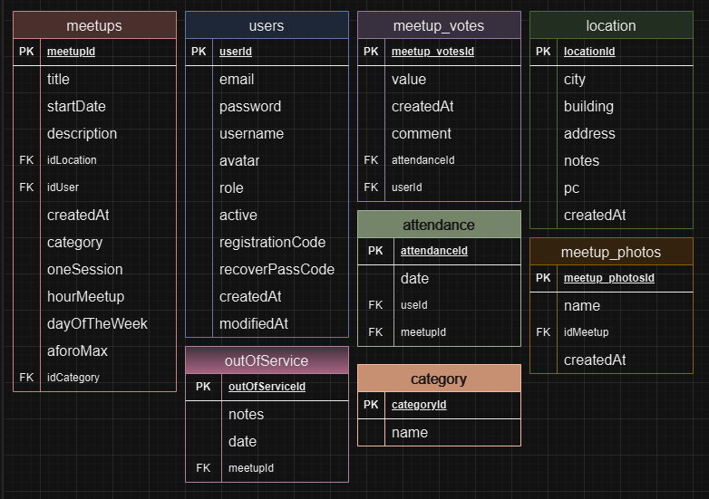
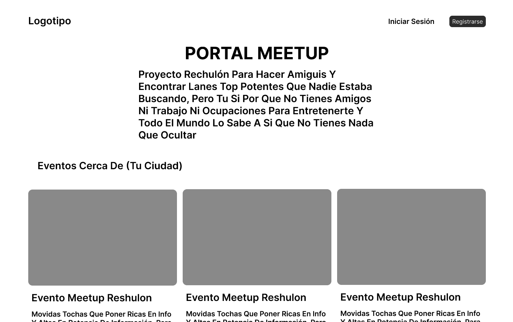

# MeetUp API

Este proyecto es una API RESTful para gestionar meetups (eventos y reuniones). Permite crear, listar, actualizar y eliminar meetups, gestionar usuarios y administrar las reservas para cada meetup.

## Contribuyentes:

1. Sergio Manzano
2. Paula Fernández
3. Jonathan Mendez
4. Diego Iván García

## Descripción

Esta API facilita la creación y gestión de meetups. Los usuarios pueden buscar eventos próximos, crear nuevos meetups, reservar su lugar y recibir notificaciones de cambios.

## Características

-   Autenticación y Autorización: Utiliza JWT para la autenticación segura de usuarios.
-   CRUD de Meetups: Crear, leer, actualizar y eliminar meetups.
-   Gestión de Usuarios: Registro e inicio de sesión de usuarios, con permisos de administración para la creación de meetups.
-   Reservas: Permite a los usuarios reservar su asistencia a los meetups.
-   Notificaciones: Los usuarios reciben notificaciones al registrarse en un meetup o cuando hay actualizaciones.
-   Escalabilidad: Arquitectura basada en microservicios y separación de responsabilidades.

## Instalación

1. Clonar este repositorio:

    `git clone git@github.com:ZuriGg/Proyecto-integrador.git`  
    `cd Proyecto-integrador`

2. Instalar las dependencias:

    `npm i`

3. Crear un archivo .env a partir del .env.example en la raíz del proyecto con las siguientes variables de entorno:

    MYSQL_HOST=  
    MYSQL_USER=  
    MYSQL_PASS=  
    MYSQL_DB=  
    MYSQL_PORT=  
    PORT=  
    SECRET=  
    SMTP_HOST=  
    SMTP_PORT=  
    SMTP_USER=  
    SMTP_PASS=  
    URL_FRONT=

4. Para la creación de las tablas de la base de datos:

    `npm run initDb`

5. Para la ejecución en modo desarrollo:

    `npm run dev`

6. Para la ejecución en producción:

    `npm start`

7. La API estará disponible en `http://localhost:(puerto que configures)`.

## Base de Datos

## Diseño de la Web

https://www.figma.com/proto/RVCmN0c1zJkctI68DpmXjI/Portal-Meetups?node-id=35-101&node-type=canvas&t=

Ejemplo del Home de nuestra página Web

## Lista de Endpoints

### Meetups

-   **post** `/meetupentries` - _Crea un nuevo meetup_
-   **get** `/meetupentries` - _Muestra las entradas según el filtro_
-   **get** `/meetupentries/:meetupId` - _Muestra la entrada clicada_
-   **get** `/categories` - _Muestra la lista de las categorías de meetup_
-   **put** `/meetupentries/edit/:meetupId` - _Permite editar un meetup_
-   **post** `/meetupentries/:meetupId/inscription` - _Para inscribirse a un meetup_
-   **delete** `/meetups/:meetupId/registration` - _Para cancelar inscripción_

### Users

-   **post** `/users/register` - _Permite registrar un usuario nuevo_
-   **get** `/users/validate/:registrationCode` - _Envía un mensaje de verificación or correo_
-   **post** `/users/login` - _Permite loguear a un usuario_
-   **get** `/users` - _Obtener perfil privado de un usuario_
-   **put** `/users/edit/:userId` - _Permite editar un usuario_
-   **put** `/users/avatar` - _Permite agregar un avatar a un usuario_
-   **post** `/users/password/recover` - _Envía un mensaje de cambio de contraseña_
-   **put** `/users/password` - _Permite cambiar la contraseña de un usuario_

## Pruebas con Postman

Para facilitar las pruebas de la API, se incluye una [Colección de Postman](https://file.notion.so/f/f/9468aeea-910c-4177-a820-cdb83aa983a9/4afebcb0-b29e-4f63-8b5b-8af6ec63f15b/meetups.postman_collection.json?table=block&id=126d98ff-1bfc-8012-a499-c0a15d84c8d7&spaceId=9468aeea-910c-4177-a820-cdb83aa983a9&expirationTimestamp=1730764800000&signature=SJwFV7FVaiXgrjpwRezAzOopsgqrUXxtGdUUp8GUD0Q&downloadName=meetups.postman_collection.json) en el archivo .

## Extras

- Admin puede ver la lista de usuarios y eliminar
- Los usuarios que no tienen actividad durante un tiempo determinado (por ejemplo: 1 año) y que un mes antes le mande un correo para avisar de que en la fecha exacta que vaya a ocurrir, que se le caducará la cuenta
- Admin puede eliminar un meetup
- 

1. Abre Postman.
2. Ve a **File > Import**.
3. Selecciona el archivo de colección `portal_meetups.postman_collection.json` ubicado en la raiz del proyecto.
4. La colección aparecerá en tu panel de Postman con todas las rutas de la API preconfiguradas.
